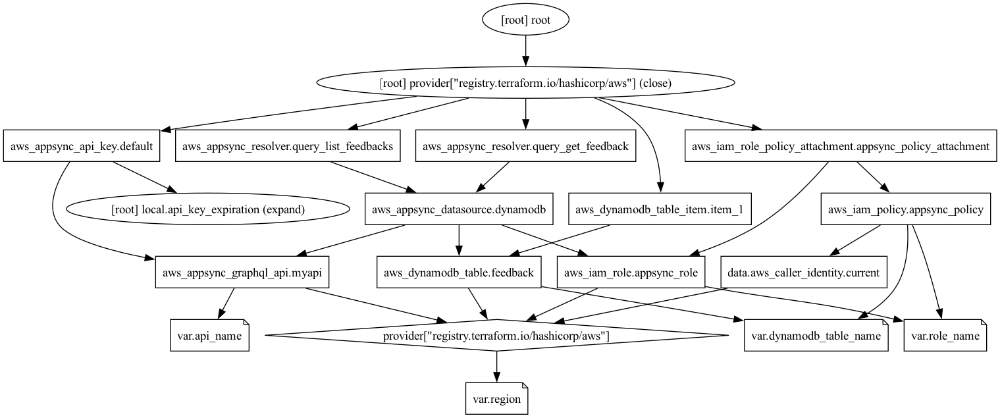

# appsync-terraform-dynamodb

Example of creation of the AWS AppSync service with DynamoDB data source.

[This git example has been used in this article of my blog](https://www.playingaws.com/posts/getting-started-with-aws-appsync-a-practical-approach-to-graphql/).

Graph diagram (`terraform graph` command):
